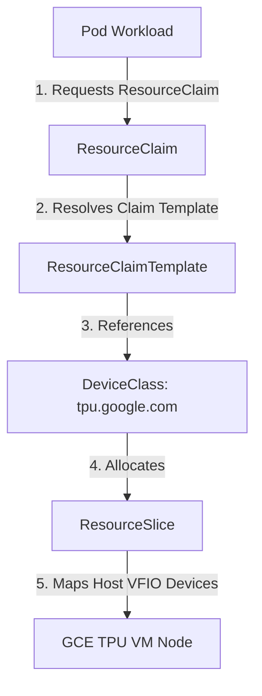

# KINGC Kubernetes in Google Cloud

`kingc` is a tool for running vanilla Kubernetes clusters in Google Cloud Platform (GCP) using standard GCE VM instances.

It is primarily designed to provide a "Kind-like" experience for cloud-based development and CI, where real cloud integrations (LoadBalancers, PD CSI, Cross-Zone networking) are required.

Note: `kingc` is a bootstrapper, not a lifecycle manager. It does not maintain state files.

## Installation

### From Source

If you have go (1.21+) installed:

go install [github.com/your-username/kingc/cmd/kingc@latest](https://github.com/your-username/kingc/cmd/kingc@latest)


### From Release

Binary releases are available on the releases page.

## Quick Start

### Prerequisites

- Google Cloud SDK (gcloud) installed and authenticated.
- SSH Keys configured (gcloud compute config-ssh).
- Quota for at least 3 CPUs (if using defaults).

### Create a Cluster

#### Option A: Simple

This will provision a VPC, a Control Plane (n1-standard-2), and a Worker MIG (2 nodes).

```sh
$ kingc create cluster --name sandbox

Creating cluster "sandbox" ...
 ✓ Ensuring VPC network "sandbox-net" 
 ✓ Provisioning Load Balancer "sandbox-api" (34.x.x.x)
 ✓ Starting control-plane "sandbox-cp" 
 ✓ Bootstrapping Kubernetes (kubeadm init) ...
 ✓ Joining workers (Instance Group "sandbox-workers") ...
Set kubectl context to "kind-sandbox"
You can now use your cluster:
kubectl get nodes
```

#### Option B: Advanced (Config File)

Create kingc.yaml:

```yaml
version: v1alpha1
spec:
  # Region applies globally, per example to Networking and API LB
  region: us-central1
  
  controlPlane:
    name: cp
    zone: us-central1-a
    machineType: n1-standard-2

  workerGroups:
  - name: workers
    replicas: 2
    zone: us-central1-b # Can be different from CP
    machineType: n1-standard-2
```

Run: `kingc create --config kingc.yaml --name sandbox`


### Export Kubeconfig

The create command automatically merges the kubeconfig into ~/.kube/config (or $KUBECONFIG).

```sh
kubectl cluster-info --context kind-sandbox
```

### Deleting a Cluster

kingc is stateless. It discovers resources via the kingc-cluster: <name> label.

```sh
kingc delete cluster --name sandbox
```

## Architecture

`kingc` wraps kubeadm and gcloud to adhere to Kubernetes best practices on GCE without the complexity of managed services.

- Control Plane: A dedicated, unmanaged instance (allows for static IP attachment and etcd stability).

- API Server Endpoint: A TCP Passthrough Network Load Balancer (ensures the API server is accessible even if the VM is replaced).

- Workers: A Managed Instance Group (MIG).

- Cloud Provider: Configures cloud-provider-gcp (external) so Service type LoadBalancer works natively.

## Configuration

`kingc` uses a declarative YAML configuration file to define complex cluster topologies (e.g., GPU nodes, multi-network setups).

## 👑 GCE TPU Serving via Dynamic Resource Allocation (DRA)

`kingc` provides native, high-performance support for Google Compute Engine (GCE) TPU v5e hardware inside your self-managed Kubernetes cluster using the out-of-tree, open-source **SIG GCE TPU Dynamic Resource Allocation (DRA) Driver**.

### 🚀 1. Architecture Overview

Our cluster deploys the native, open-source Dynamic Resource Allocation driver. DRA abstracts device access using pure Kubernetes resource claims:



---

### 🛠️ 2. Host Infrastructure Safety: Pinned Memory (MEMLOCK)

The GCE TPU VFIO drivers (libtpu) require pinning physical memory pages, which utilizes the kernel's locked memory allocation capabilities. 

By default, the `containerd` runtime service in GCE standard OS setups has a very low limit of only **8MB** for locked memory (`LimitMEMLOCK`). This causes JAX and PyTorch runtimes to fail with `UNKNOWN: TPU initialization failed: Couldn't mmap: Resource temporarily unavailable`.

`kingc` automatically patches this in the GCE bootstrap phase by injecting the following systemd override config into `/etc/systemd/system/containerd.service.d/limits.conf` before starting `containerd`:

```ini
[Service]
LimitMEMLOCK=infinity
```

---

### 🧪 3. Reusable Example 1: JAX Core Hardware Verification

Use the following manifest to deploy a single-pod verifier that requests all available TPU cores on the node via a stable `resource.k8s.io/v1` ResourceClaimTemplate, runs the JAX verifier, and outputs the coordinates and process indexes of all 8 TPU v5e Tensor cores.

#### `tpu-verification-pod.yaml`
```yaml
apiVersion: v1
kind: Pod
metadata:
  name: tpu-verification-pod
  namespace: default
spec:
  restartPolicy: Never
  tolerations:
  - key: "google.com/tpu"
    operator: "Exists"
    effect: "NoSchedule"
  resourceClaims:
  - name: tpu
    resourceClaimTemplateName: tpu-claim-template
  containers:
  - name: vllm-tpu-verifier
    image: docker.io/vllm/vllm-tpu:2e33fe419186c65a18da6668972d61d7bbc31564
    command:
    - python3
    - -c
    - |
      import jax
      print("🚀 G8S TPU DRA Verification Success!")
      print(f"Jax Local Devices count: {jax.local_device_count()}")
      print(f"Jax Devices list: {jax.devices()}")
    resources:
      claims:
      - name: tpu
    volumeMounts:
    - name: dshm
      mountPath: /dev/shm
  volumes:
  - name: dshm
    emptyDir:
      medium: Memory
---
apiVersion: resource.k8s.io/v1
kind: ResourceClaimTemplate
metadata:
  name: tpu-claim-template
  namespace: default
spec:
  spec:
    devices:
      requests:
      - name: tpus
        exactly:
          deviceClassName: tpu.google.com
          allocationMode: All
```

---

### 🤖 4. Reusable Example 2: openai-Compatible vLLM serving

Create your Hugging Face token as a secret:

```bash
kubectl create secret generic hf-token-secret \
  --from-literal=token="<YOUR_HUGGING_FACE_TOKEN>" \
  --namespace default
```

Use the following manifest to deploy an OpenAI-compatible vLLM model server (serving the Qwen2-1.5B model) backed by our GCE TPU DRA driver.

#### `vllm-tpu-deployment.yaml`
```yaml
apiVersion: resource.k8s.io/v1
kind: ResourceClaimTemplate
metadata:
  namespace: default
  name: multi-tpu-claim
spec:
  spec:
    devices:
      requests:
      - name: tpus
        exactly:
          deviceClassName: tpu.google.com
          allocationMode: All
---
apiVersion: apps/v1
kind: Deployment
metadata:
  name: vllm-tpu-server
  namespace: default
spec:
  replicas: 1
  selector:
    matchLabels:
      app: vllm-tpu
  template:
    metadata:
      labels:
        app: vllm-tpu
    spec:
      tolerations:
      - key: "google.com/tpu"
        operator: "Exists"
        effect: "NoSchedule"
      containers:
      - name: vllm-tpu
        image: docker.io/vllm/vllm-tpu:2e33fe419186c65a18da6668972d61d7bbc31564
        command: ["python3", "-m", "vllm.entrypoints.openai.api_server"]
        args:
        - --host=0.0.0.0
        - --port=8000
        - --max-model-len=8192
        - --model=Qwen/Qwen2-1.5B
        env:
          - name: HUGGING_FACE_HUB_TOKEN
            valueFrom:
              secretKeyRef:
                name: hf-token-secret
                key: token
        resources:
          claims:
          - name: tpus
        volumeMounts:
        - name: dshm
          mountPath: /dev/shm
      volumes:
      - name: dshm
        emptyDir:
          medium: Memory
      resourceClaims:
      - name: tpus
        resourceClaimTemplateName: multi-tpu-claim
---
apiVersion: v1
kind: Service
metadata:
  name: vllm-service
  namespace: default
spec:
  type: LoadBalancer
  selector:
    app: vllm-tpu
  ports:
    - name: http
      protocol: TCP
      port: 8000
      targetPort: 8000
```

---

### 🧪 5. Testing the vLLM Service

```bash
# 1. Fetch the External IP and store it in a bash variable
export VLLM_IP=$(kubectl get svc vllm-service -n default -o jsonpath='{.status.loadBalancer.ingress[0].ip}')

# 2. Verify the IP is provisioned before proceeding
if [ -z "$VLLM_IP" ]; then
  echo "The External IP is still pending. Please wait a minute and run this snippet again."
else
  echo "Success! vLLM Service IP found: $VLLM_IP"

  # 3. Verify the Server is Alive (List Models)
  echo -e "\n--- Fetching Available Models ---"
  curl -s http://$VLLM_IP:8000/v1/models

  # 4. Test Inference (Chat Completions)
  echo -e "\n\n--- Testing Inference ---"
  curl -X POST http://$VLLM_IP:8000/v1/chat/completions \
    -H "Content-Type: application/json" \
    -d '{
      "model": "Qwen/Qwen2-1.5B",
      "messages": [
        {"role": "system", "content": "You are a helpful and concise assistant."},
        {"role": "user", "content": "Explain what a TPU is in one sentence."}
      ],
      "max_tokens": 50,
      "temperature": 0.7
    }'
fi
```


## FAQ

### Why not just use GKE?

GKE is fantastic, but sometimes you need to test the control plane itself, have much more control over the cluster, or debug the Google Cloud Controller Manager. In those cases, `kingc` gives you more control over the cluster.

### Why not use Kops?

[Kops](https://kops.sigs.k8s.io/) is a powerful lifecycle management tool (upgrades, terraform integration, state storage). `kingc` is an ephemeral tool. It is designed to spin up a cluster in 3 minutes, run a test, and delete it or leverage other tools for lifecycle management.

### Where is the CNI?

Like Kind, `kingc` installs [kindnet](https://github.com/kubernetes-sigs/kindnet) by default, but users can disable the default CNI and install their own.

## Thanks

Special thanks to @bentheelder for creating [Kind](https://github.com/kubernetes-sigs/kind) and inspiring the design and philosophy of this project.
