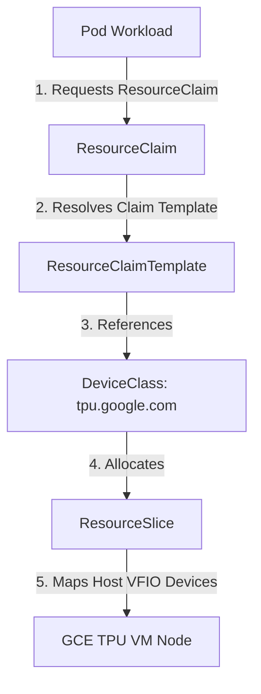

# 👑 GCE TPU Serving via Dynamic Resource Allocation (DRA)

This guide explains how to serving Google Compute Engine (GCE) TPU v5e hardware inside your self-managed Kubernetes cluster using the out-of-tree, open-source **SIG GCE TPU Dynamic Resource Allocation (DRA) Driver**.

---

## 🚀 1. Architecture Overview

Rather than using proprietary GKE device plugins (which carry GKE-specific metadata and GCE Instance Metadata Server dependencies), our cluster deploys the native, open-source Dynamic Resource Allocation driver. 

DRA abstracts device access using pure Kubernetes resource claims:



---

## 🛠️ 2. Host Infrastructure Safety: Pinned Memory (MEMLOCK)

The GCE TPU VFIO drivers (libtpu) require pinning physical memory pages, which utilizes the kernel's locked memory allocation capabilities. 

By default, the `containerd` runtime service in GCE standard OS setups has a very low limit of only **8MB** for locked memory (`LimitMEMLOCK`). This causes JAX and PyTorch runtimes to fail with `UNKNOWN: TPU initialization failed: Couldn't mmap: Resource temporarily unavailable`.

`kingc` automatically patches this in the GCE bootstrap phase by injecting the following systemd override config into `/etc/systemd/system/containerd.service.d/limits.conf` before starting `containerd`:

```ini
[Service]
LimitMEMLOCK=infinity
```

---

## 🧪 3. Reusable Example 1: JAX Core Hardware Verification

Use the following manifest to deploy a single-pod verifier that requests all available TPU cores on the node via a stable `resource.k8s.io/v1` ResourceClaimTemplate, runs the JAX verifier, and outputs the coordinates and process indexes of all 8 TPU v5e Tensor cores.

### `tpu-verification-pod.yaml`
```yaml
apiVersion: v1
kind: Pod
metadata:
  name: tpu-verification-pod
  namespace: default
spec:
  restartPolicy: Never
  tolerations:
  - key: "google.com/tpu"
    operator: "Exists"
    effect: "NoSchedule"
  resourceClaims:
  - name: tpu
    resourceClaimTemplateName: tpu-claim-template
  containers:
  - name: vllm-tpu-verifier
    image: docker.io/vllm/vllm-tpu:2e33fe419186c65a18da6668972d61d7bbc31564
    command:
    - python3
    - -c
    - |
      import jax
      print("🚀 G8S TPU DRA Verification Success!")
      print(f"Jax Local Devices count: {jax.local_device_count()}")
      print(f"Jax Devices list: {jax.devices()}")
    resources:
      claims:
      - name: tpu
    volumeMounts:
    - name: dshm
      mountPath: /dev/shm
  volumes:
  - name: dshm
    emptyDir:
      medium: Memory
---
apiVersion: resource.k8s.io/v1
kind: ResourceClaimTemplate
metadata:
  name: tpu-claim-template
  namespace: default
spec:
  spec:
    devices:
      requests:
      - name: tpus
        exactly:
          deviceClassName: tpu.google.com
          allocationMode: All
```

---

## 🤖 4. Reusable Example 2: openai-Compatible vLLM serving

Use the following manifest to deploy an OpenAI-compatible vLLM model server (serving the Qwen2-1.5B model) backed by our GCE TPU DRA driver.

### `vllm-tpu-deployment.yaml`
```yaml
apiVersion: resource.k8s.io/v1
kind: ResourceClaimTemplate
metadata:
  namespace: default
  name: multi-tpu-claim
spec:
  spec:
    devices:
      requests:
      - name: tpus
        exactly:
          deviceClassName: tpu.google.com
          allocationMode: All
---
apiVersion: apps/v1
kind: Deployment
metadata:
  name: vllm-tpu-server
  namespace: default
spec:
  replicas: 1
  selector:
    matchLabels:
      app: vllm-tpu
  template:
    metadata:
      labels:
        app: vllm-tpu
    spec:
      tolerations:
      - key: "google.com/tpu"
        operator: "Exists"
        effect: "NoSchedule"
      containers:
      - name: vllm-tpu
        image: docker.io/vllm/vllm-tpu:2e33fe419186c65a18da6668972d61d7bbc31564
        command: ["python3", "-m", "vllm.entrypoints.openai.api_server"]
        args:
        - --host=0.0.0.0
        - --port=8000
        - --max-model-len=8192
        - --model=Qwen/Qwen2-1.5B
        env:
          - name: HUGGING_FACE_HUB_TOKEN
            value: "REPLACE_WITH_YOUR_HUGGING_FACE_TOKEN"
        resources:
          claims:
          - name: tpus
        volumeMounts:
        - name: dshm
          mountPath: /dev/shm
      volumes:
      - name: dshm
        emptyDir:
          medium: Memory
      resourceClaims:
      - name: tpus
        resourceClaimTemplateName: multi-tpu-claim
---
apiVersion: v1
kind: Service
metadata:
  name: vllm-service
  namespace: default
spec:
  selector:
    app: vllm-tpu
  ports:
    - name: http
      protocol: TCP
      port: 8000
      targetPort: 8000
```
